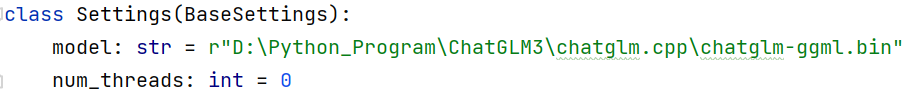
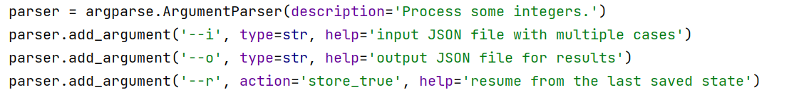

# ChatGLM3 Prompt任务
## Step 1 -> 本地大模型ChatGLM3部署指南
### 1.在AutoDL上部署ChatGLM3

**[ChatGLM3的HuggingFace地址->](https://huggingface.co/THUDM/chatglm3-6b)**

**[ChatGLM3的魔搭社区地址->](https://modelscope.cn/models/ZhipuAI/chatglm3-6b/summary)**

**[ChatGLM3的GitHub项目地址->](https://github.com/THUDM/ChatGLM3)**
***
如果本地电脑只有CPU，想通过GPU部署模型，可选择在AutoDL上租用GPU进行大模型部署。AutoDL租用及部署请参考下文，本文仅提供可能出现的情况的处理。

**[AutoDL部署参考文章->](http://t.csdnimg.cn/6emsj)**
***
租用GPU后需要下载ChatGLM3的模型文件，根据文中提供的方法：

    git lfs install
    git clone https://huggingface.co/THUDM/chatglm3-6b

会出现进程被杀死的情况，即无法将模型文件下载到租用的GPU中，但是却会出现GPU的数据盘被占用的情况。处理方式如下：

    通过Hugging Face官网或者魔搭社区下载ChatGLM3的模型文件后存储到阿里云盘中，经过AutoDL的AutoPanel功能将模型文件传输到auto-tmp数据盘中。

需要注意的是命令行模式即cli_demo可以很好的运行，其他的demo存在一定的问题，不建议使用。且本次任务通过命令行模式完成即可。
*** 
***
### 2.通过CPU部署ChatGLM3模型

    通过CPU部署的ChatGLM3模型的回答效率与GPU部署的模型存在差距但不大。在CPU上部署的模型是一个量化后的模型，依然需要将ChatGLM3的模型文件下载到本地。

CPU部署的参考文章如下：

**[CPU部署参考文章GitHub地址->](https://github.com/li-plus/chatglm.cpp)**

参考该文章的方法进行模型量化的时候会出现，中断的情况，即**量化后的chatglm-ggml.bin文件的文件大小应为3.7GB左右**，出现这种情况的原因可能是因为在量化的过程需要将原模型再运行一次，需要较大的内存大概32GB。解决方案如下：

    跳过参考文章的模型量化过程，去下载已经量化好的模型文件。

**[Chatglm-ggml.bin量化模型的Hugging Face地址->](https://huggingface.co/kingzzm/chatglm3-6b-ggml)**

下载好量化模型后将模型文件放在对应的文件位置，继续参考文章的Build&Run部分即：

    cmake -B build
    cmake --build build -j --config Release

在完成Cmake后执行提供的命令：

    ./build/bin/main -m chatglm-ggml.bin -i

会发现报错找不到文件的情况，是因为完成Cmake后main.exe文件是在Release目录下，我们应该执行的命令行为：

    ./build/bin/Release/main -m chatglm-ggml.bin -i

## Step 2 -> 本地ChatGLM3以及远程ChatGPT Prompt测试

**ChatGLM3以及远程ChatGPT Prompt中英文对应如下所示(可用来测试)：**

    示例一：

    中文：现在你是一个专业的答案分析师，我会给你一段文字包含材料和问题，你需要对这段文字进行分析，给出结果，结果要包含选择的答案和答案分析，输出的结果示例：'''答案：A.加快发展先进制造业，分析:我国全面提升实体经济的重点是加快发展先进制造业，因为这有助于推动经济发展、提高国家实力、增强创新能力。'''。接下来是你需要分析的文本：1969年，尼尔·阿姆斯特朗在阿波罗11号任务期间成为第一个在月球上行走的人。这一历史事件标志着人类太空探索的重要里程碑。谁是第一个在月球上行走的人？A) 巴兹·奥尔德林 B) 尼尔·阿姆斯特朗 C) 尤里·加加林 D) 约翰·格伦

    英文：Now you are a professional answer analyst. I will give you a piece of text containing material and a question, and you need to analyze this text, provide the result, which should include the chosen answer and answer analysis. Here is the text you need to analyze:In 1969, Neil Armstrong became the first person to walk on the moon during the Apollo 11 mission. This historic event marked a significant milestone in human space exploration.Who was the first person to walk on the moon?A) Buzz Aldrin B) Neil Armstrong C) Yuri Gagarin D) John Glenn

    示例二：

    中文：艺术家文森特·梵高是荷兰后印象派画家，以其独特的风格和色彩运用而闻名于世。他的作品《星夜》被认为是他最具代表性的作品之一。《星夜》是哪位艺术家的代表作品？A) 莫奈 B) 达·芬奇 C) 梵高 D) 雅克-路易·大卫

    英文：Artist Vincent van Gogh is a Dutch post-impressionist painter, renowned for his unique style and use of colors. His artwork "Starry Night" is considered one of his most iconic works. Whose masterpiece is "Starry Night"? A) Monet B) Da Vinci C) Van Gogh D) Jacques-Louis David

    示例三：
    中文：莎士比亚是英国文学史上最伟大的戏剧作家之一，他的作品被翻译成多种语言并在世界范围内广泛上演。其中，他的悲剧《哈姆雷特》被认为是他最杰出的作品之一。谁是《哈姆雷特》的作者？A) 哈罗德·品钦 B) 查尔斯·狄更斯 C) 威廉·莎士比亚 D) 简·奥斯汀

    英文：Shakespeare is one of the greatest playwrights in British literary history, with his works translated into multiple languages and widely performed worldwide. Among them, his tragedy "Hamlet" is considered one of his most outstanding works. Who is the author of "Hamlet"? A) Harold Pinter B) Charles Dickens C) William Shakespeare D) Jane Austen

## Step 3 -> ChatGLM3 Question-Answer任务Prompt编写
本次提供了一个baseline代码，可以根据baseline代码来进行修改和润色，实现自己的任务。

一个好的Prompt对于模型的输出结果有很大的影响。对于Prompt的编写我们需要注意：

    1.明确我们的任务。
    2.确定输出形式[Input Format],返回结果形式[Output Format]。
    3.[Guidence]很重要，[Guidence]就是对模型推理的一种限制。
    4.最好存在示例，包含[Input]和[Output]，可以帮助模型理解,本文提供了一个Example.txt其中存在示例和[Input]示例。

- ### 通过接口调用远程大模型GPT3.5
通过OPENAI官网或者国内镜像源获取API-key以及Base-url来更改configs文件中的json即可。

- ### 通过接口调用本地大模型ChatGLM3

跟着**Step1**完成后我们可以下载到一个**chatglm.cpp**的代码文件，在该文件中的**chatglm_cpp**的目录下提供了**openai_api.py**和**langchain_api.py**两个接口文件，我们**需要把下面图片中的model路径更改为自己的量化模型路径**。

    随后运行该py文件，即可在本地的8000端口开启一个API
    我们通过修改configs.glm3.json文件中的API-KEY(和远程大模型一致)和base-url=http://127.0.0.1:8000/v1

至此完成对本地大模型的接口调用。

## 命令行形式批处理数据
命令行中只包含了以下三个参数，--i表示输入的数据文件路径，--o表示输出文件路径，--r表示是否要进行断点续传。

    可以运行该指令执行该脚本:
    python AnswerQuestion.py --i data.json --o output.json